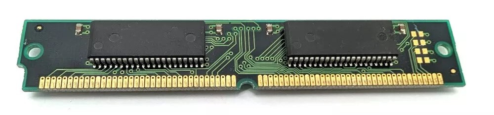
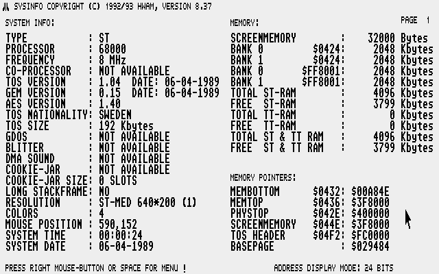

<h1 align="center">
PCB for upgrading an Atari C070789 or C070859 to 4 Mb.
</h1>

<h2 align="center">
Either a 520 STf(m) or a 1040 STf(m).
</h2>

---
 

---

## What you will need  

- 1 PCBs. Order with the [gerber] file "C070789-C070859 1Mx16 gerber.zip" from your favorite PCB manufactory. 
- 2 pcs of RAM chips.
- 3 pcs of 100nF (0,1uF) 0806 SMD capacitors.
- 1 pcs of 33 ohm resistor 0805 SMD.
- 3 pcs 68 ohm 1/4W (0,25W) thru hole resistors (if it is missing on motherboard).
- Pinheaders (2,54mm spacing).

---

## Get yourself some chips 

I buy SIMM modules from eBay and desolder the chips on it with a hot air station/gun. But you can also buy them individually I guess. That will be more expensive. Below you see a picture of a double sided 8Mb, 72 pin SIMM module. 4Mb single sided SIMM can also be found. It can have 2 or 3 chips on each side (I have only seen 2 chip variant). If 3 chips then one chip would be different and that chip is for the parity bit calculation. That is not needed. I used FPM memory here. I have not tried EDO. 

Chips that can be used on this PCB is 1048576-word by 16-bit dynamic random access memories. Speed is usually between 60ns to 80ns. Lower numer is faster.

| Manufacturer      | Chip code  |
| :---              | :---       |
| Hitachi           | HM5118160  |
| OKI Semiconductor | MSM5118165 |
| Samsung/SEC       | KM416C1200 and K4F151611 |
| Toshiba           | TMS418160  |

---

## How to

| Solder 1 PCB with chips and capacitors. Take note of the orientation on pin 1 on PCB and chip (pin 1 is marked with circle on PCB. Notch on the left side of chip and text is readable (not upside-down) then pin 1 is located on bottom left side. |  |
| :--- | :---: |
| Cut pinheaders and place on motherboard. I did lower right side then a few here and there to get it straight. Do ***_NOT_*** solder in. Place PCB on top of unsoldered pins. Solder the RAM PCB first when it's resting on the motherboard pins. Lift RAM PCB and put in a few more of the single pins. Put RAM PCB back and solder those. Keep doing until you have all the pins soldered on the RAM PCB. Then put the RAM PCB back on motherboard. Trim the lenght of pins and solder the pins underneath the motherboard. |     |
| There ya go! |     |
| Solder the three resistors if they are missing (68ohm thru hole) on R71, R72 and R73 for the RAS1, CASH1L and CAS1L signals on the motherboard. |     |

A9 (or MAD9) is located on PLCC MMU on pin 64 and SMD MMU on pin 66 
---

## Useful info

If you are planning on doing all 8 PCB I suggest to desolder 4 chip on existing RAM on the motherboard and swap it for a RAM PCB and then test that you still got 2 Mb of RAM. To remove you could snip the legs of the chips on the motherboard with a flush cutter. Then desolder the pins where you need holes for the new PCB. The existing decoupling capacitors can be removed by the same way. They can also be left in but they are a bit thicker then the pinheaders.

You do not need a hot air station/gun. Chip can be desolder by bending a thick copper wire around all legs and the add a lot of solder. Then dragging the soldering iron across all the legs on each side until it's loose. It will be messy. Desolder the exess with braid. The SMD RAM chips is soldered on RAM PCB with drag soldering and a knife edge on the soldering iron. If you are more comfortable using other methods, use that! Flux is your friend. Use alot of flux!

---

## Testing

Use [SYSINFO] to test if you have 4Mb.

---

PCB made by Daniel Guldkrans aka DoG in Eagle January 2024.

[SYSINFO]: sysinfo/SYSINFO.PRG
[gerber]: gerbers/C070789-C070859 1Mx16 gerber.zip

