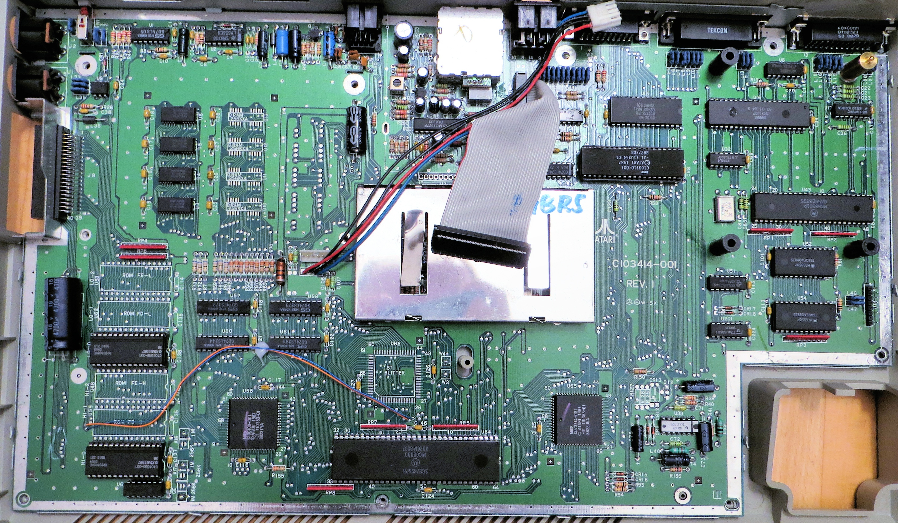
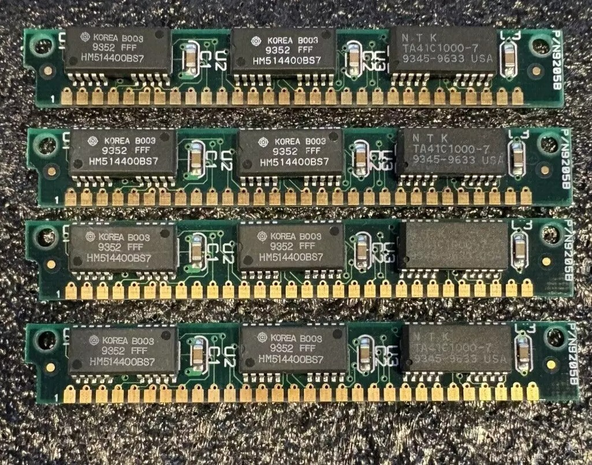
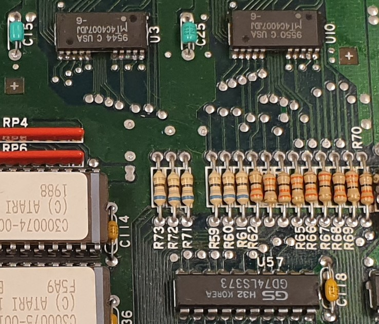
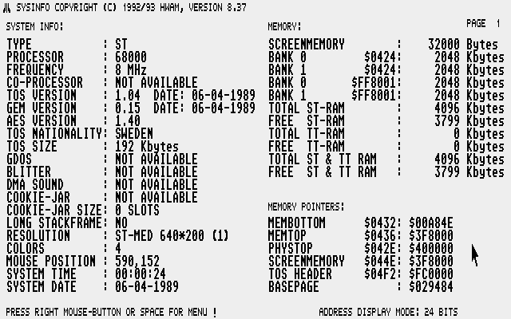

<h1 align="center">
Upgrading an Atari C103414 to 4 Mb.
</h1>

<h2 align="center">
Either a 520 STf(m) or a 1040 STf(m).

---
 

---
</h2>

## What you will need  

You do not need a PCB for this mod.

- 8 pcs of RAM chips (1048576-word by 4-bit) in 20/26pin SOJ package. I have not tried if TSOP package will fit.
- 1 pcs of 33 ohm 1/4W (0,25W) thru hole resistor.
- 3 pcs 68 ohm 1/4W (0,25W) thru hole resistors (if it is missing on motherboard R71, R72, R73).
- Heat shrink tubing to isolate the soldering of wire/resistor. The isolation from a thicker wire could also work. I personally would avoid tape.
- Wire (I used single strand kynar wire).

---

## Get yourself some chips 

I buy SIMM modules from eBay and desolder the chips on it with a hot air station/gun. But you can also buy them individually. That will probably be more expensive. Below you see a picture of single sided 1Mb, 30 pin SIMM modules. 4Mb single sided or 8Mb double sided 72pin SIMM can also be found. It can have 2 or 3 chips. It can also have 8 or 9 chips on each side. If 3 or 9 chips SIMM then one chip would be different and that is for the parity bit calculation. That is not needed. I didn't pay attention when I did this project so I apperantly used EDO memory (MT4C4007J) and it seems to work fine. Otherwise FPM is recommended. 72pin seems to be a bit cheaper since they are more common and a "newer" technology. More pictures of [SIMM sticks](images/SIMM/).

Chips that can be used in this project is 1048576-word by 4-bit dynamic random access memories. Speed is usually between 60ns to 80ns. Lower number is faster.

| Manufacturer      | Chip code  |
| :---              | :---       |
| Hitachi           | HM514400   |
| Hyundai           | HY514400   |
| LG/Goldstar       | GM71C4400  |
| MicronTech        | MT4C4001   |
| Mitsubishi        | M5M44400   |
| NEC               | 424400     |
| NPN               | NN514400   |
| Oki Semiconductor | M514400C   |
| Samsung/SEC       | KM44C1000  |
| Sharp	            | LH6B4400K  |
| Texas Instruments | TMS44400   |
| Toshiba           | TC514400   |

---

## How to

| Start by desoldering all the ram chips on the motherboard. Beware of delamination and warping of the motherboard if you heat it to long on the same place.. |  |
| :--- | :---: |
| Solder in the new ram. I used a knife edge tip on my soldering iron and a lot of flux. Take note of pin 1 on silkscreen marked with a dot and on the chips. So if you have the ports on the motherboard against your stomach you should be able to read the text on the chips without tilting your head. |     |
| Solder in the three resistors if they are missing (68ohm through hole) on R71, R72 and R73 for the CAS1H, CAS1L and RAS1 signals on the motherboard. They should already be fitted from factory regardless if you had 0,5Mb or 1Mb ram to begin with. But check either way. |  |
| The pads for A9 is not connected to anything on the motherboard so we need to connect all of them together. Solder a wire between all of [pin 5 on the chips](images/pinout.png). I did it by going down on each memory bank and then solder it on to the 33 ohm resistor. Then heat shrink tubing over it. |  |
| Solder another wire on the other leg of the resistor to [PLCC MMU pin 64](images/mmu%20plcc.png). Heat shrink tubing on that too. |  |

---

## Useful info

You do not need a hot air station/gun. Chip can be desolder by bending a thick copper wire around all legs and then adding a lot of solder. By dragging the soldering iron across the wire and all the legs on each side, the chip will eventually come loose. Use two irons for even faster desoldering. Low melting solder, like chip quik, can also be used. It will be messy. Desolder the exess with braid. If you are more comfortable using other methods, use that! Flux is your friend. Use alot of flux!

---

## Testing

Use [SYSINFO] to test if you have 4Mb. The test will not work without the wire since A9 will be floating and all sort of scramble memory will occur. You can tie A9 to ground via a 10K resistor and then get 1Mb.

---

[SYSINFO]: sysinfo/SYSINFO.PRG

