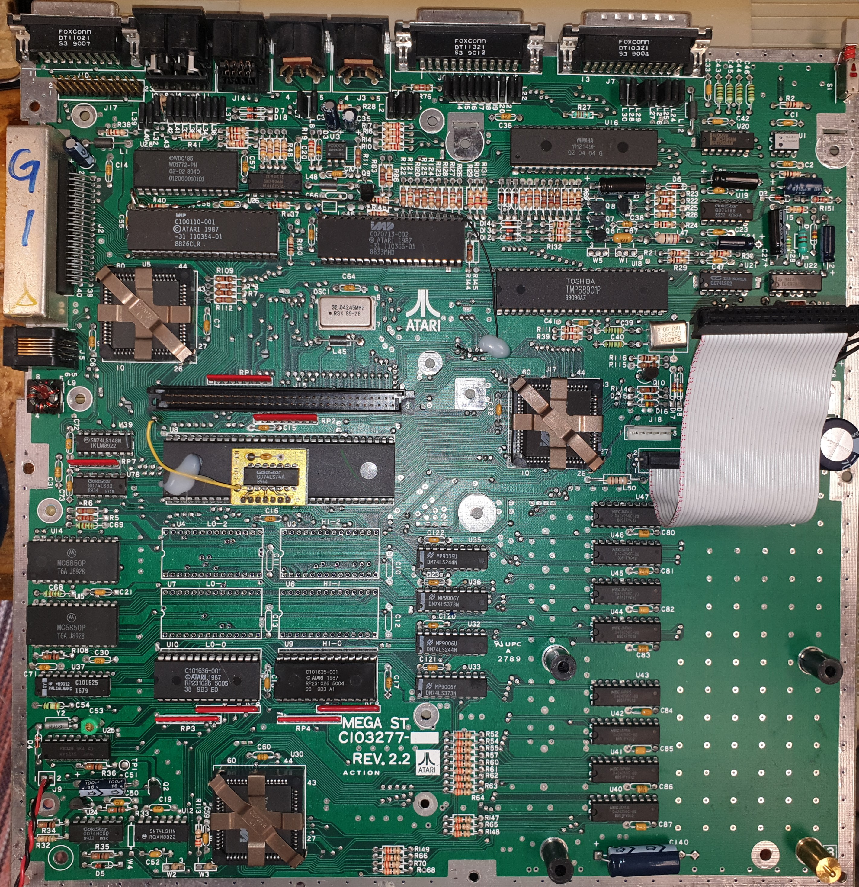
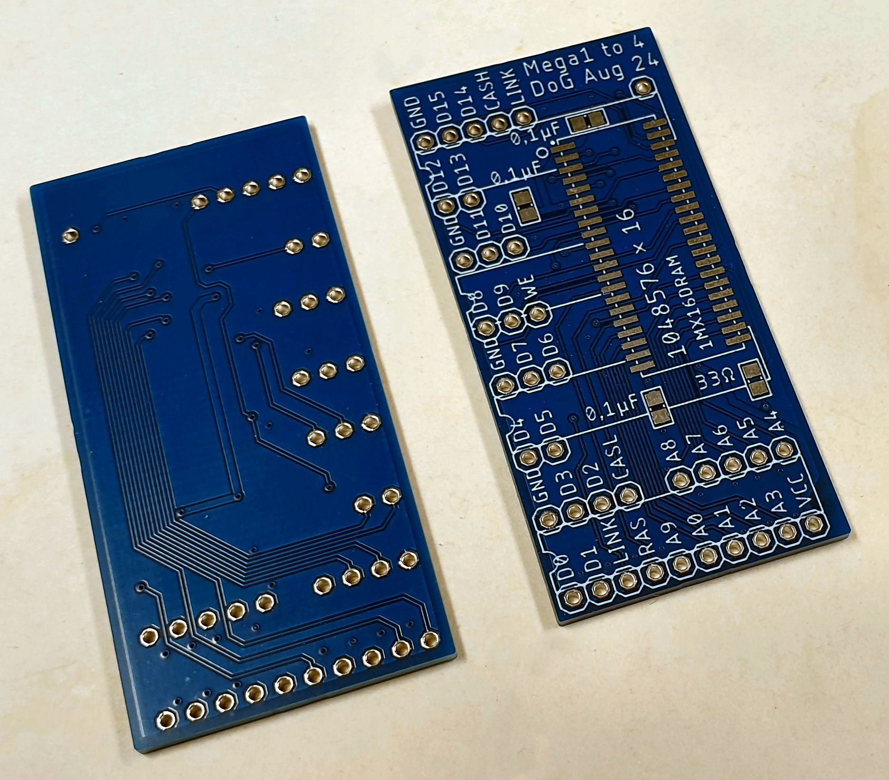
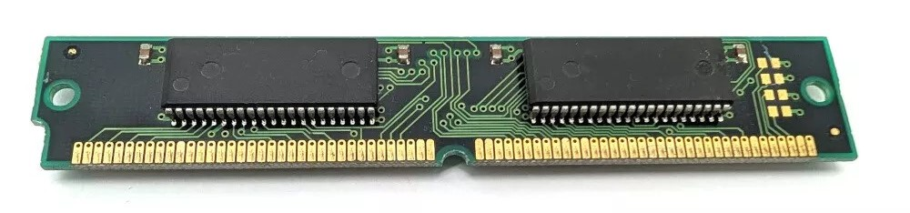
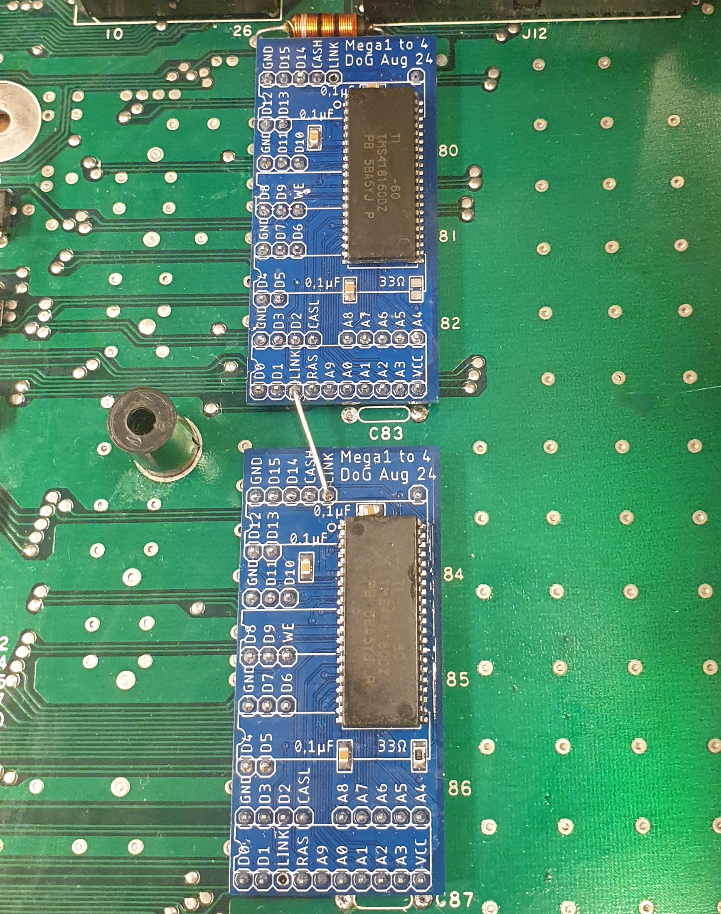
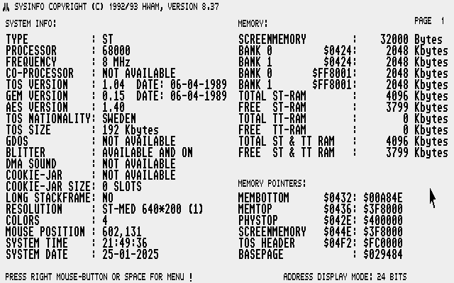

<h1 align="center">
PCB for upgrading an Atari Mega ST1 to 4 Mb.
</h1>

<h2 align="center">
On a C103277 motherboard.
</h2>

---
 

---

## What you will need  

- 1 RAM PCB. Order with the [gerber] file "C103277_1Mx16_gerber.zip" from your favorite PCB manufactory. 
- 2 pcs of RAM chips (1048576-word by 16-bit) in 42pin SOJ package (TSOP might work, I have not tried).
- 6 pcs of 100nF (0,1uF) 0805 SMD capacitors.
- 1 pcs of 33 ohm 0805 SMD resistor.
- Pinheaders (2,54mm spacing).
- A piece of wire (I used single strand kynar wire).
- A small piece of wire or a piece of leg from a component that reach across the boards.

---

## Get yourself some chips 

I buy SIMM modules from eBay and desolder the chips on it with a hot air station/gun. But you can also buy them individually. That will probably be more expensive but save you the hassle of desoldering. Below you see a picture of a double sided 8Mb, 72 pin SIMM module. 4Mb single sided SIMM can also be found. It can have 2 or 3 chips on each side (I have only seen 2 chip variant). If 3 chips then one chip would be different and that chip is for the parity bit calculation. That is not needed. I used FPM memory here. I have not tried EDO. 

Chips that can be used on this PCB is 1048576-word by 16-bit dynamic random access memories. Speed is usually between 60ns to 80ns. Lower numer is faster.

| Manufacturer      | Chip code  |
| :---              | :---       |
| Hitachi           | HM5118160  |
| OKI Semiconductor | MSM5118165 |
| Samsung/SEC       | KM416C1200 and K4F151611 |
| Toshiba           | TMS418160  |

---

## How to

| Start by desoldering all the ram chips on the motherboard. Either by hot air station/gun or with braid/solder pump. Beware of delaminatiton and warping of the motherboard if you heat it to long on the same place. If you don't have any plans for the old ram, just snipp all the legs off the chips with a flush cutter. Then desolder only the pins you need to fit the RAM PCB. Also some decoupling capacitors needs to be desoldered. They are a bit thicker then the plastic on the pin headers. |    |
| :--- | :---: |
| Solder 2 PCB with chips and capacitors. Take note of the orientation on pin 1 on PCB and chip (pin 1 is marked with circle on PCB. Notch on the left side of chip and text is readable (not upside-down) then pin 1 is located on bottom left side. One of the PCB needs a 33ohm resistor soldered as well. That PCB is the one you will connect the wire from underneath the motherboard. |    |
| The inductor L50 needs to be pushed upwards a little bit to fit the top RAM PCB in place. Just smush it with your thumb. |     |
| Make a 10 pin pinheader strip. Remove pin 3. Drill a 1mm hole where the old pin was. This is done to easier fit the lin between the two boards via a wire or a piece of leg from a component (like a resistor). |   |
| Cut pinheaders and place on motherboard. Do ***_NOT_*** solder in. Do ***_NOT_*** solder pin where it's marked "LINK" on the RAM PCB. Place PCB on top of unsoldered pins. Solder the RAM PCB first when it's resting on the motherboard pins. You could probably fit all pins at the same time. Otherwise do the corners and the bottom one to get the PCB straight. Then lift RAM PCB and put in a few more of the small pin strips in the middle. Put RAM PCB back and solder those. Keep doing until you have all the pins soldered on the RAM PCB. (A note here, the RAM PCB with the 33ohm resistor should be fitted at the bottom of the motherboard). Then put the RAM PCB back on motherboard. Trim the lenght of pins and solder the pins underneath the motherboard. |     |
| Now we need to make a bridge between the two PCBs. Take a leg from a component. I save cutoffs from through hole resistors, capacitors, transistor and other components in a little jar. You could obiously use a small wire as well. Trim to lenght and solder ***_ONLY_*** the two RAM PCB together. The LINK wire should under NO circumstance touch or be solder to the motherboard underneath! So keep the bend down the holes in the RAM PCB short. Like 2mm. |  |
| A9 (or MAD9) needs to be connected from RAM PCB to MMU with a wire. MAD9 is located on [PLCC MMU on pin 64](images/mmu%20plcc.png) and this is done on the solderside underneath the motherboard. I used some glue gun to fixate the wire in place. |   |

---

## Useful info

You do not need a hot air station/gun. Chip can be desolder by bending a thick copper wire around all legs and then adding a lot of solder. By dragging the soldering iron across the wire and all the legs on each side, the chip will eventually come loose. If you got two irons it will go even faster. It will be messy. Desolder the exess with braid. The SMD RAM chips is soldered on RAM PCB with drag soldering and a knife edge on the soldering iron. If you are more comfortable using other methods, use that! Flux is your friend. Use alot of flux!

---

## Testing

Use [SYSINFO] to test if you have 4Mb.

---

PCB made by Daniel Guldkrans aka DoG in Eagle August 2024.

[SYSINFO]: sysinfo/SYSINFO.PRG
[gerber]: gerbers/C103277_1Mx16_gerber.zip

