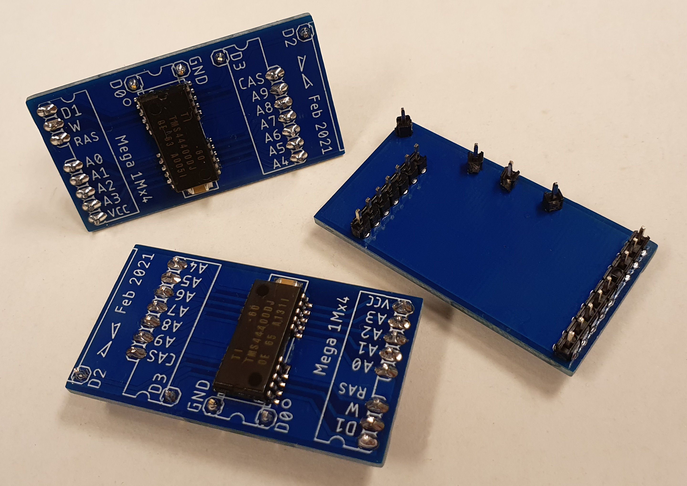

<h1 align="center">
PCB for upgrading an Atari Mega ST2 to 4 Mb.
</h1>

---
 

---

## What you will need  

- 4 or 8 PCB. Order with the gerber file "Mega1Mx4bits.zip" from your favorite PCB manufactory. 
- 4 or 8 RAM chips
- 4 or 8 100nF (0,1uF) 1206 SMD capacitors.
- 3 pcs 68 ohm 1/4W (0,25W)

---

## Get yourself some chips 

I buy SIMM modules from eBay and desolder the chips on it with hot air station/gun. But you also by them individually.

Chips that can be used on this PCB is 1048576-word by 4-bit dynamic random access memories. Speed is usually between 60ns to 80ns. Lower numer is faster.

| Manufacturer     | Chip code |
| :---             | :---      | 
| Hitachi          | HM514400  |
| Hyundai          | HY514400  |
| LG/Goldstar      | GM71C4100 |
| MicronTech       | MT4C4001  |
| Mitsubishi       | M5M44400  |
| NEC              | 424400    |
| NPN              | NN514400  |
| Oki              | M514400C  |
| Samsung/SEC      | KM44C1000 |
| Sharp            | LH6B4400K |
| Texas Instrument | TMS44400  |
| Toshiba          | TC514400  |

[gerbers] 

---

## How to

| Start by soldering the three missing resistors on R71, R72 and R74 for the RAS2, CASH2L on the motherboard. |  |
| :--- | :---: |
|  |   |
| :--- | :---: |

---

## Useful info

-  Use only one 3.3V LDO regulator. If you don't use the LDO from the bluepill there is a SOT-23 footprint on the other side (IC3) that can be used. 
- Battery connector, 32,768KHz crystal (Y3), capacitor is not used (C9 and C12).
- For programming the STM32 use the `3V3`, `GND`, `PA9` and `PA10` with a [FTDI programmer] (with 3V3 on VCC pin). Set `BOOT0` to 1 with the jumper. Reset switch is probably of use as well when programming. Download [STM32CubeProgrammer] and upload the v2.1 [binary] firmware to the STM32. <strong>20220103: I updated the [binary] to get it working better as discussed in [issue 16]. I used 18 MHz but also did a version with 8MHz.</strong>
- I made the PCB to use 19 pin D-SUB connector and solder it directly into the PCB. They can be pricy to get hold of so I made my own out of 25 pin D-SUB connector insted. The solder end don't go that far into the PCB so don't force it in and try to get it flush. There should be a gap.
- <strong>20220103: I could never get the unit to autoboot with HDDriver. But EmuTOS detected it and autobooted. Also P.Putniks HD driver autobooted. Tried in TOS v2.06, TOS v1.04 (with [IDE patch] from Christian Zietz) and EmuTOS v1.</strong>

---

## Speed test

I used [AHPT] by P.Putnik to test the units speed. Here you can download [AHPT94.ZIP] directly. <strong>Updated speed test 20220103.</strong>

---

Bill of material for this is listed in the <a href="https://github.com/tomtebloss/acsi2stm/blob/master/gerbers/ACSI2STM%20v1.2%20BOM.txt">`ACSI2STM vx.x BOM.txt`</a> 

PCB made by [DoG] in Eagle v9.6.2.

[gerbers]: gerbers/Mega1Mx4bits.zip

[FTDI programmer]: https://www.google.com/search?q=FTDI+programmer&tbm=isch&ved=2ahUKEwjl8Pi_q_nyAhXxlosKHXmeC9EQ2-cCegQIABAA&oq=FTDI+programmer&gs_lcp=CgNpbWcQAzIFCAAQgAQyBQgAEIAEMgUIABCABDIFCAAQgAQyBQgAEIAEMgQIABBDMgUIABCABDIGCAAQBxAeMgYIABAHEB4yBggAEAcQHjoGCAAQBRAeOgQIABAYUNs_WK1QYM9TaABwAHgAgAFQiAGFAZIBATKYAQCgAQGqAQtnd3Mtd2l6LWltZ8ABAQ&sclient=img&ei=juU9YeXxEPGtrgT5vK6IDQ&bih=660&biw=1818&hl=en
[binary]: binary/acsi2stm.v2.1.18MHz.ino.generic_stm32f103c.bin
[STM32CubeProgrammer]: https://www.st.com/en/development-tools/stm32cubeprog.html
