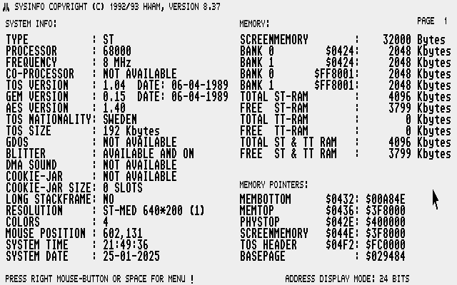

<h1 align="center">
PCB for upgrading an Atari Mega ST2 to 4 Mb.
</h1>

<h2 align="center">
Or changing existing RAM on a 4Mb motherboard.
</h2>

---
 

---

## What you will need  

- 4 or 8 PCB. Order with the [gerber] file "Mega1Mx4bits.zip" from your favorite PCB manufactory. 
- 4 or 8 RAM chips
- 4 or 8 100nF (0,1uF) 1206 SMD capacitors.
- 3 pcs 68 ohm 1/4W (0,25W)
- Pinheaders 2,54mm spacing

---

## Get yourself some chips 

I buy SIMM modules from eBay and desolder the chips on it with a hot air station/gun. But you can also buy them individually I guess. That will be more expensive. Below you see a picture of a double sided 8Mb, 72 pin SIMM module. 4Mb single sided SIMM can also be found. 30 or 72 pin SIMMs. It can have 8 or 9 chips on each side. If 9 chip then one chip would be different and that chip is for the parity bit calculation. That is not needed. I used FPM memory here. I have not tried EDO. 

Chips that can be used on this PCB is 1048576-word by 4-bit dynamic random access memories. Speed is usually between 60ns to 80ns. Lower numer is faster.

| Manufacturer     | Chip code |
| :---             | :---      | 
| Hitachi          | HM514400  |
| Hyundai          | HY514400  |
| LG/Goldstar      | GM71C4100 |
| MicronTech       | MT4C4001  |
| Mitsubishi       | M5M44400  |
| NEC              | 424400    |
| NPN              | NN514400  |
| Oki              | M514400C  |
| Samsung/SEC      | KM44C1000 |
| Sharp            | LH6B4400K |
| Texas Instrument | TMS44400  |
| Toshiba          | TC514400  |

---

## How to

| Solder 4 PCB (or 8). Take note of the orientation on pin 1 on PCB and chip (pin 1 is marked with circle on PCB. Notch on the left side of chip and text is readable (not upside-down). |  |
| :--- | :---: |
| Cut pinheaders and place on motherboard. Do ***_NOT_*** solder in. PLace PCB on top of unsoldered pins. Solder the RAM PCB first when it's resting on the motherboard pins. Then solder the pins underneath the motherboard. |     |
| There ya go! Now do the rest. Either you only solder in 4 RAM PCB on the empty slots or remove the existing RAM and solder in all 8 is up to you. |     |
| Soldering the three missing resistors (68ohm thru hole) on R71, R72 and R74 for the RAS2, CASH2L and CAS2L signals on the motherboard. |     |

---

## Useful info

If you are planning on doing all 8 PCB I suggest to desolder 4 chip on existing RAM on the motherboard and swap it for a RAM PCB and then test that you still got 2 Mb of RAM. To remove you could snip the legs of the chips on the motherboard with a flush cutter. Then desolder the pins where you need holes for the new PCB. The existing decoupling capacitors can be removed by the same way. They can also be left in but they are a bit thicker then the pinheaders.

You do not need a hot air station/gun. Chip can be desolder by bending a thick copper wire around all legs and the add a lot of solder. Then dragging the soldering iron across all the legs on each side until it's loose. It will be messy. Desolder the exess with braid. The SMD RAM chips is soldered on RAM PCB with drag soldering and a knife edge on the soldering iron. If you are more comfortable using other methods, use that! Flux is your friend. Use alot of flux!

---

## Testing

Use [SYSINFO] to test if you have 4Mb.

---

PCB made by Daniel Guldkrans aka DoG in Eagle february 2021.

[SYSINFO]: sysinfo/SYSINFO.PRG
[gerber]: gerbers/Mega1Mx4bits.zip

